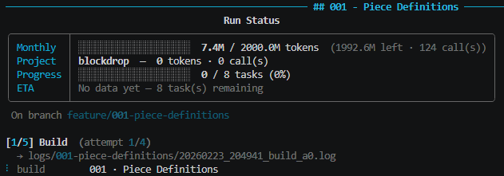
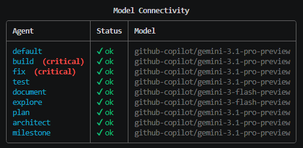

# agentik

An autonomous development pipeline that drives
[opencode](https://opencode.ai) through a full **build → test → fix → document
→ commit** pipeline for every task defined in a project ROADMAP.

Write a structured `ROADMAP.json`, run `python agentik.py`, and let AI agents
implement your project task by task — with git history, cost tracking, parallel
builds, and resume support built in.

## Features

- **Zero-touch pipeline** — build, test, fix, lint, document, and commit in one
  loop, fully automated
- **Parallel builds** — independent tasks run concurrently (dependency-aware
  scheduling)
- **Multi-ecosystem** — auto-detects Python, Deno, Node/TS, Go, Rust; any
  ecosystem works with manual config
- **Budget tracking** — monthly token limits, per-project cost logs, estimated
  USD spend
- **Resume on Ctrl-C** — saves state after every phase; pick up exactly where
  you left off
- **Milestone gates** — semver tagging and merge-to-main via `agent: milestone`
  tasks
- **Deploy hooks** — provider-agnostic deployment via ROADMAP `deploy` block
- **Agent logs** — every opencode call logged with timestamp, phase, and attempt
  number
- **Git managed (opt-in)** — automatic branching, commits, merges, and tags
  when enabled
- **Human-in-the-loop review** — optional pause after build to inspect diffs
  and approve/reject before committing
- **ROADMAP generation** — describe a project in plain English and let an AI
  agent generate a valid `ROADMAP.json` for you
- **Test coverage gating** — enforce minimum coverage thresholds; the pipeline
  fails if coverage drops below the configured percentage
- **Git rollback on failure** — automatically revert feature branch changes
  when a task exceeds max attempts
- **Webhook notifications** — send pipeline events (task complete, task failed,
  pipeline done) to Slack, Discord, or any HTTP endpoint
- **Dry-run / cost estimation** — preview token usage, estimated USD cost, and
  time for remaining tasks without running anything (via web UI)
- **Structured error diagnostics** — JSON failure reports saved per task with
  last error, failing test, attempt count, and token spend
- **Interactive HTML dependency graph** — open a standalone graph in your
  browser with colour-coded status and token budgets
- **Web UI dashboard** — React + Tailwind + shadcn frontend with live
  WebSocket updates, 10 tabs (Overview, Graph, Tasks, Logs, Editor, Budget,
  Generate, Models, Review, Controls), Monaco JSON editor, React Flow
  dependency graph, project creation wizard, and full pipeline control via
  REST API

## Quickstart

### Prerequisites

- **Python 3.12+**
- [opencode](https://opencode.ai) installed and on PATH (or use Docker — see below)
- An LLM provider configured in `opencode.jsonc` (e.g. GitHub Copilot,
  Anthropic, OpenAI)

### Install (local)

```bash
git clone https://github.com/BlockAIx/agentik.git
cd agentik
pip install -r requirements.txt
```

### Install (Docker — recommended)

Docker bundles Python, opencode, Node.js, and all dependencies in a single
image. No host-level installs required beyond Docker itself.

```bash
git clone https://github.com/BlockAIx/agentik.git
cd agentik
cp .env.example .env          # edit with your API keys
./scripts/start.sh            # Linux/macOS
.\scripts\start.ps1           # Windows PowerShell
```

Or use docker compose directly:

```bash
docker compose up              # web UI at http://localhost:8420
docker compose run agentik --pipeline   # interactive pipeline
```

See [Docker setup](#docker-setup) below for full details.

### Create a project

Create a folder under `projects/` with a `ROADMAP.json`. You can write it by
hand or **ask any AI model** to generate it for you — the workspace-level
[AGENTS.md](AGENTS.md) contains the full ROADMAP schema, task field reference,
and ecosystem conventions, so a model working from the repository root has all
the context it needs.

Example prompt for a new project:

> Create a new project `projects/my-api/ROADMAP.json` for a Python REST API
> with three modules: models, routes, and auth. Follow the ROADMAP format in
> AGENTS.md. Include proper depends_on ordering, outputs, and acceptance
> criteria. Then validate it with
> `python check_roadmap.py projects/my-api/ROADMAP.json`.

To add tasks to an existing project:

> Read `projects/my-api/ROADMAP.json` and add tasks 4–6 for WebSocket support:
> a connection manager, event handlers, and integration tests. Continue the
> existing id sequence and set depends_on correctly. Validate with
> `python check_roadmap.py projects/my-api/ROADMAP.json`.

You can also start from a minimal hand-written file:

```
projects/
  my-project/
    ROADMAP.json
```

```json
{
  "name": "My Project v0.1",
  "ecosystem": "python",
  "preamble": "",
  "tasks": [
    {
      "id": 1,
      "title": "Core Module",
      "depends_on": [],
      "outputs": ["my_project/core.py", "tests/test_core.py"],
      "acceptance": "all tests in tests/test_core.py pass",
      "description": "Implement `greet(name: str) -> str` returning `\"Hello, <name>!\"`.\nTests: normal input, empty string, non-ASCII."
    }
  ]
}
```

See [ROADMAP_EXAMPLE.md](ROADMAP_EXAMPLE.md) for the full syntax reference.

### Run

```bash
python agentik.py
```

An arrow-key project selector appears, then pick a mode:

- **Run pipeline** — work through every uncompleted task
- **Run pipeline (verbose)** — same, but stream full agent output
- **Show dependency graph** — colour-coded task graph in terminal
- **Open interactive graph** — launch a graph in your browser
- **Generate ROADMAP from description** — describe a project, get a valid ROADMAP
- **Generate project AGENTS.md** — create or regenerate per-project agent instructions
- **Start web UI** — launch the React dashboard at `http://127.0.0.1:8420`

Press **Ctrl-C** at any time to save state and resume later.

## How it works

For each task agentik executes:

| #  | Phase    | What happens                                                           |
|----|----------|------------------------------------------------------------------------|
| 1  | Build    | opencode agent implements the module + unit tests                      |
| 2  | Deps     | Installs any new dependencies the agent declared                       |
| 3  | Test     | Runs ecosystem test suite (pytest / deno test / cargo test / etc.)     |
| 4  | Coverage | Runs tests with coverage; fails if below `min_coverage` threshold      |
| 5  | Fix      | If tests fail → fix agent patches code (same session, up to N retries) |
| 6  | Static   | Lint & type checks (ruff / deno check+lint / tsc / go vet / clippy)    |
| 7  | Stfix    | If static checks fail → fix agent resolves them (up to 2 retries)      |
| 8  | Review   | Human-in-the-loop: show diff, wait for approve/reject (if enabled)     |
| 9  | Doc      | Document agent updates README                                          |
| 10 | Commit   | `git add → commit → merge to develop` (when git is managed)           |
| 11 | Notify   | Send webhook notification for pipeline events (if configured)          |
| 12 | Deploy   | Runs deploy script if configured in ROADMAP (optional)                 |

## Project structure

```
agentik/
├── agentik.py               # entry point
├── Dockerfile               # full-stack Docker image
├── docker-compose.yml       # recommended way to run
├── .env.example             # template for API keys
├── runner/                  # pipeline engine
│   ├── config.py            #   constants, Rich console, prompt loader
│   ├── opencode.py          #   opencode invocation wrappers
│   ├── pipeline.py          #   main pipeline orchestration
│   ├── roadmap.py           #   ROADMAP.json parsing and helpers
│   ├── state.py             #   progress tracking, budget accounting
│   ├── workspace.py         #   ecosystem detection, git operations
│   ├── coverage.py          #   test coverage gating
│   ├── diagnostics.py       #   structured failure reports
│   ├── dryrun.py            #   dry-run cost / time estimation
│   ├── graph_html.py        #   interactive HTML dependency graph
│   ├── notify.py            #   webhook notification support
│   ├── plan.py              #   ROADMAP generation from NL descriptions
│   ├── review.py            #   human-in-the-loop review mode
│   ├── rollback.py          #   git rollback on task failure
│   └── web/                 #   web UI dashboard
│       ├── app.py           #     FastAPI backend + REST API
│       └── frontend/        #     React + Tailwind + shadcn SPA
├── scripts/
│   ├── start.sh             # quick-start script (Linux/macOS)
│   └── start.ps1            # quick-start script (Windows)
├── helpers/
│   └── check_roadmap.py     # ROADMAP structural validator
├── tests/                   # unit tests
├── prompts/                 # prompt templates (Mustache-style)
│   ├── build.md
│   ├── fix.md
│   ├── static_fix.md
│   ├── document.md
│   └── milestone.md
├── AGENTS.md                # agent instructions for this workspace
├── LICENSE                  # MIT license
├── budget.json              # global limits and token price table
├── check_roadmap.py         # convenience shim for helpers/check_roadmap.py
├── opencode.jsonc           # agent definitions (models, permissions)
├── requirements.txt         # dependencies
├── ROADMAP_EXAMPLE.md       # full ROADMAP syntax reference
└── projects/
    └── <project-name>/
        ├── ROADMAP.json         # task list (you write this)
        ├── budget.json          # per-project cost log (auto-managed)
        ├── .runner_state.json   # progress + resume state (auto-managed)
        ├── AGENTS.md            # auto-generated agent instructions
        ├── <source>/            # implementation (created by agents)
        └── tests/               # unit tests (created by agents)
```

Each project under `projects/` is its own directory. When git is managed
(`"git": {"enabled": true}` in ROADMAP), each project gets its own git
repository with automatic branching and commits.

## ROADMAP.json reference

### Task fields

| Field         | Required           | Type             | Description                            |
| ------------- | ------------------ | ---------------- | -------------------------------------- |
| `id`          | **yes**            | integer          | Unique task ID                         |
| `title`       | **yes**            | string           | Short imperative title (≤ 6 words)     |
| `depends_on`  | **yes**            | array of ints    | Task IDs this depends on (or `[]`)     |
| `outputs`     | **yes**\*          | array of strings | Expected output files                  |
| `acceptance`  | **yes**\*          | string           | Human-readable done criterion          |
| `description` | no                 | string           | Full task spec (can contain markdown)  |
| `agent`       | no                 | string           | Override agent (default: `"build"`)    |
| `ecosystem`   | no                 | string           | Override ecosystem for this task       |
| `context`     | no                 | array of strings | Files pre-injected into the build prompt |
| `version`     | no                 | string           | Semver tag (milestone tasks only)      |
| `deploy`      | no                 | boolean          | Run deploy hook after this task        |

\* Required for all tasks except `agent: "milestone"` tasks.

### Preamble

Everything outside the `tasks` array — `name`, `ecosystem`, and `preamble` — is
project-level config. The `preamble` string is injected into every build prompt
as project context, so architecture notes defined once guide every task.

### Validation

```bash
python check_roadmap.py projects/<name>/ROADMAP.json
```

Checks numbering, required fields, dependency references, single root task
(exactly one `depends_on: []`), disjoint parallel outputs, title length,
architecture rules, and unknown fields.

## Agents



Defined in `opencode.jsonc`. agentik selects the right agent per phase;
`agent:` in the ROADMAP only controls the first-pass build.

| Agent       | Writes files | Role                                                |
| ----------- | ------------ | --------------------------------------------------- |
| `build`     | yes          | Implement module + unit tests                       |
| `fix`       | yes          | Repair failing tests (continues build session)      |
| `test`      | tests only   | Extend / improve the test suite                     |
| `document`  | docs only    | README update, no logic changes                     |
| `explore`   | no           | Read-only research spike                            |
| `plan`      | no           | Lightweight planning                                |
| `architect` | no           | Design / ADRs (use via task, not automatic)          |
| `milestone` | no           | Review gate + semver tag on develop                  |

## Budget and cost tracking

Configure in `budget.json`:

```json
{
  "monthly_limit_tokens": 2000000000,
  "per_task_limit_tokens": 2000000,
  "max_attempts_per_task": 4,
  "max_parallel_agents": 3,
  "token_prices_usd_per_million": {
    "input": 1.25,
    "output": 5.00,
    "cache_read": 0.31,
    "cache_write": 1.25
  }
}
```

- **Monthly limit** — agentik aborts (exit 2) when exceeded
- **Per-task limit** — reserved for future enforcement
- **Max attempts** — fix retries before abandoning a task
- **Token prices** — used to estimate USD cost in the status table

Every run displays a status table with token usage, estimated cost, progress
bar, and ETA.

## Parallel builds

When `max_parallel_agents > 1`, independent tasks (no dependency edges between
them) run concurrently. The build phase is parallel; test, static, and document
phases run once per batch.

**Important:** parallel tasks must not have overlapping `outputs:` or modify
shared files. The validator enforces disjoint outputs for tasks that share the
same dependency set. Only one task may have `depends_on: []` (the project
foundation, layer 0).

## Git workflow (opt-in)

Git management is **off by default**. Enable it per project:

```json
{ "git": { "enabled": true } }
```

When enabled:

```
main  ←  develop  ←  feature/<slug>  (per task)
```

Each task is committed on `feature/<slug>`, merged to `develop`, and tagged
`task-<NNN>`. Milestone tasks tag `develop` with a semver tag.

When git is **not** managed, agentik skips all git operations. You can use
your own version control workflow.

## Deploy hook (optional)

Deployment is **opt-in and provider-agnostic**. Add a top-level `deploy` block
to your `ROADMAP.json`:

```json
{
  "deploy": {
    "enabled": true,
    "script": "scripts/deploy.sh",
    "env": { "provider": "fly", "app": "my-app", "region": "fra" }
  }
}
```

- `enabled` — master switch (default `true`)
- `script` — path to deploy script relative to project (default `scripts/deploy.sh` or `.ps1`)
- `env` — key-value pairs injected as `DEPLOY_*` environment variables

**Per-task gating:** add `"deploy": true` to specific tasks. When any task has
a `deploy` field, only those marked `true` trigger the hook.

**Suppress deployment:**
- `RUNNER_NO_DEPLOY=1` — global suppression
- `deploy.enabled: false` in the ROADMAP — per-project opt-out

**Backward compatibility:** if no ROADMAP `deploy` block exists, agentik
falls back to reading a `deploy.json` file at the project root.

## Agent logs

Every opencode invocation is logged to `projects/<name>/logs/<task-slug>/`:

```
logs/<task-slug>/<yyyymmdd_HHMMSS>_<phase>_a<attempt>.log
```

In **compact mode** (default), only status lines appear in the terminal. On
failure, the last 40 log lines are shown inline. In **verbose mode**, all agent
output streams in real time. Logs are gitignored automatically.

## State and resume

Progress is stored in `projects/<name>/.runner_state.json` and committed to the
project repo. Adding new tasks to a ROADMAP works seamlessly — completed tasks
are skipped, new ones are picked up automatically.

## Supported ecosystems

agentik auto-detects these ecosystems from manifest files. Any ecosystem
works — set `"ecosystem": "<name>"` in your ROADMAP and agentik will use
it as-is (unknown values produce a warning, not an error).

| Ecosystem | Manifest           | Test runner       | Static checks              |
| --------- | ------------------ | ----------------- | -------------------------- |
| Python    | `requirements.txt` | `pytest`          | `ruff`                     |
| Deno      | `deno.json`        | `deno test`       | `deno check` + `deno lint` |
| Node      | `package.json`     | `vitest` / `jest` | `tsc --noEmit`             |
| Go        | `go.mod`           | `go test`         | `go vet`                   |
| Rust      | `Cargo.toml`       | `cargo test`      | `cargo clippy`             |

## Web UI

agentik includes an optional web dashboard built with React, Tailwind CSS, and
shadcn/ui. It provides a browser-based interface to monitor and control the
pipeline.

### Prerequisites

```bash
pip install fastapi uvicorn[standard]
```

### Launch

Select **Start web UI** from the agentik menu, or run directly:

```bash
python -c "from runner.web.app import start_server; start_server()"
```

The dashboard opens at `http://127.0.0.1:8420` with these tabs:

| Tab        | Description                                                    |
| ---------- | -------------------------------------------------------------- |
| Overview   | Stats cards, progress bar, token usage chart, project info     |
| Graph      | React Flow dependency graph with colour-coded task status      |
| Tasks      | Sortable task table with status badges, agents, and tokens     |
| Logs       | Log tree per task with inline failure report display           |
| Editor     | Monaco JSON editor for ROADMAP.json with save and validate     |
| Budget     | Monaco JSON editor for per-project budget.json                 |
| Generate   | Describe a project → AI generates a valid ROADMAP.json         |
| Models     | Per-agent model configuration with live connection testing     |
| Review     | View git diff + approve/reject (human-in-the-loop)             |
| Controls   | Run/stop pipeline with live log streaming                      |

Live updates are pushed over WebSocket — no polling needed.

### Developing the frontend

```bash
cd runner/web/frontend
npm install
npm run dev          # Vite dev server with API proxy to :8420
npm run build        # production build → runner/web/static/
```

## Human-in-the-loop review

Enable review mode to pause after each build phase and inspect changes before
committing. Add to your `ROADMAP.json`:

```json
{ "review": true }
```

Or enable per-task by adding `"review": true` to individual tasks. When
enabled, the pipeline shows a diff and waits for you to approve or reject.

## Test coverage gating

Enforce minimum test coverage by adding to your `ROADMAP.json`:

```json
{ "min_coverage": 80 }
```

The pipeline runs tests with coverage collection after the standard test phase.
If coverage falls below the threshold, the task is treated as failed and enters
the fix cycle.

## Webhook notifications

Send events to any HTTP endpoint (Slack, Discord, custom). Add to your
`ROADMAP.json`:

```json
{
  "notify": {
    "url": "https://hooks.slack.com/services/...",
    "events": ["task_complete", "task_failed", "pipeline_done"]
  }
}
```

Events are sent as JSON POST requests. Notification failures are logged but
never break the pipeline.

## Dry-run mode

Estimate cost and time without running anything. Dry-run is available through the
web UI dashboard — select a project and view the cost breakdown in the Controls
tab.

## Git rollback on failure

When git is managed and a task exceeds `max_attempts_per_task`, the runner
automatically hard-resets the feature branch to the last clean commit. This
prevents broken code from accumulating on feature branches. Rollback only
applies when `"git": {"enabled": true}` is set.

## Docker setup

agentik ships with a `Dockerfile` and `docker-compose.yml` that bundle the
entire stack: Python 3.12, opencode CLI (Go binary), Node.js + pnpm, git, and
the pre-built web UI.

### Quick start

```bash
cp .env.example .env   # add your LLM API keys
./scripts/start.sh     # builds + starts the web UI (Linux/macOS)
.\scripts\start.ps1    # same for Windows PowerShell
```

### docker compose commands

| Command | Description |
|---------|-------------|
| `docker compose up` | Build image + start web UI at `:8420` |
| `docker compose up -d` | Detached mode |
| `docker compose run --rm agentik --pipeline` | Interactive pipeline |
| `docker compose down` | Stop and remove containers |

### Start script flags

The scripts in `scripts/` wrap docker compose for convenience:

| Flag | Description |
|------|-------------|
| *(none)* or `--web` | Build + start web UI |
| `--pipeline` | Interactive pipeline mode |
| `--build-only` | Build the Docker image only |
| `--detach` / `-d` | Start web UI in background |
| `--down` / `--stop` | Stop containers |

### Environment variables

Configure via `.env` (loaded automatically by docker compose):

| Variable | Description |
|----------|-------------|
| `OPENCODE_API_KEY` | opencode auth token |
| `ANTHROPIC_API_KEY` | Anthropic API key |
| `OPENAI_API_KEY` | OpenAI API key |
| `GITHUB_TOKEN` | GitHub Copilot token |
| `OPENCODE_CMD` | Override opencode binary path (default: `opencode`) |
| `AGENTIK_PORT` | Web UI port (default: `8420`) |

### Volumes

The compose file mounts:
- `./projects` → `/app/projects` — your project data persists on the host
- `./opencode.jsonc` → `/app/opencode.jsonc` — edit models without rebuilding
- `./budget.json` → `/app/budget.json` — adjust budgets without rebuilding

### Building manually

```bash
docker build -t agentik .
docker run -it --rm -v ./projects:/app/projects -p 8420:8420 agentik
```

## Contributing

Contributions are welcome. Please:

1. Fork the repo and create a feature branch
2. Keep `pytest tests/` green
3. Update `AGENTS.md` and `README.md` if you change agentik behaviour
4. Submit a pull request

## License

[MIT](LICENSE)
